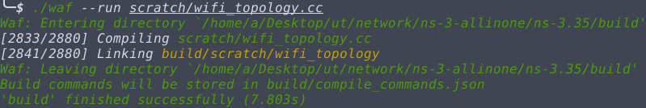
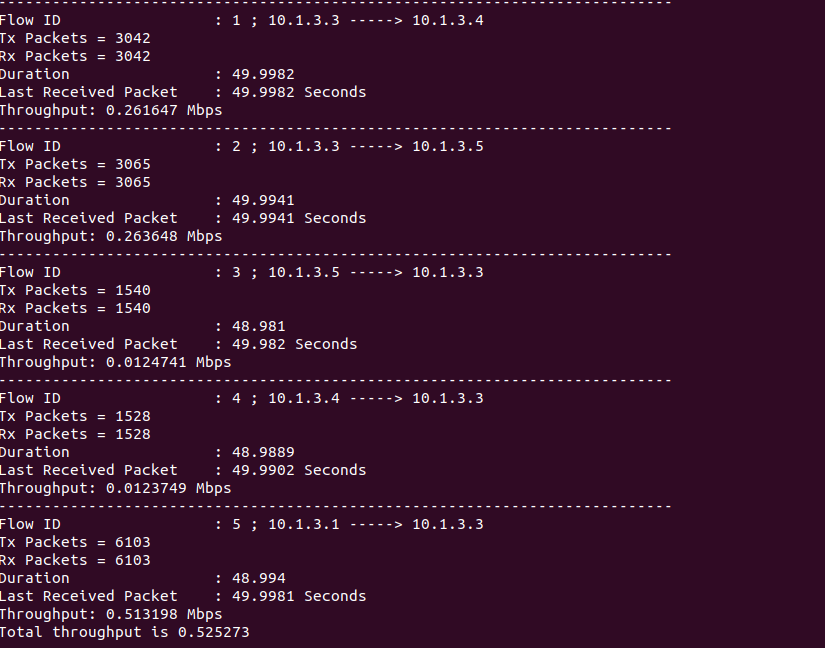

# Network Simulator


# Topology

In this project we simulated following topology:

<h1 align="left">
  </a>
  <br>
</h1>


## How To Compile & run

1) Download  
2) Put __wifi_topology.cc__ in __scratch__ file,
3) Run the following commands

```bash
./waf configure
./waf --run scratch/wifi_topology.cc
```
<h1 align="left">
  </a>
  <br>
</h1>


## Result

<h1 align="left">
  </a>
  <br>
</h1>
